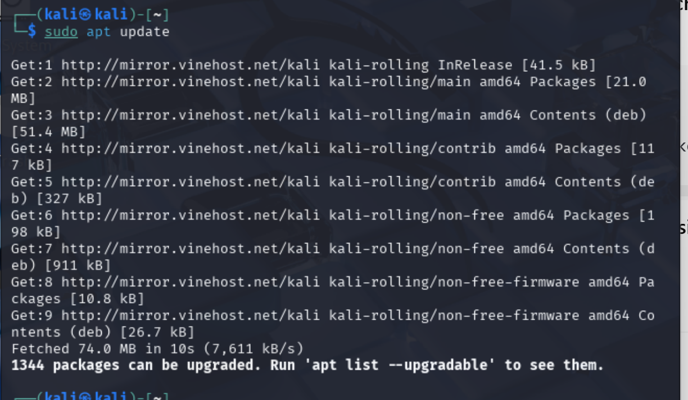
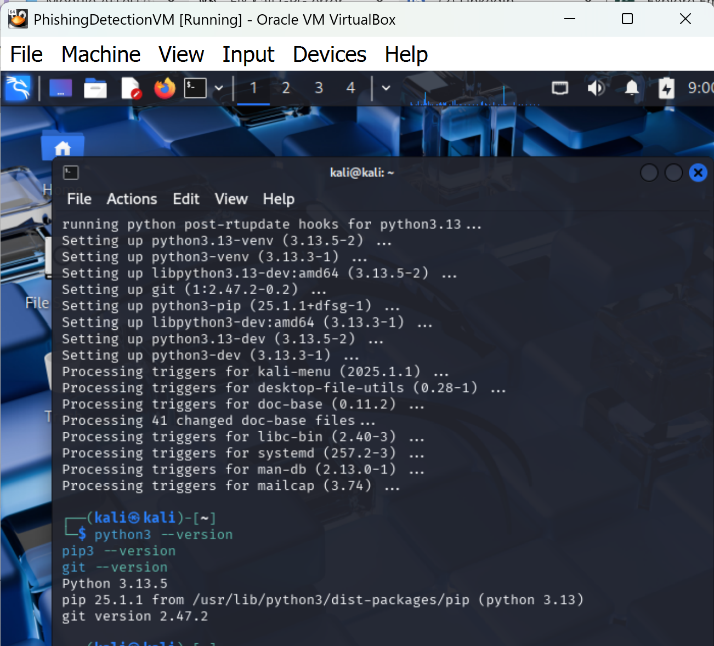
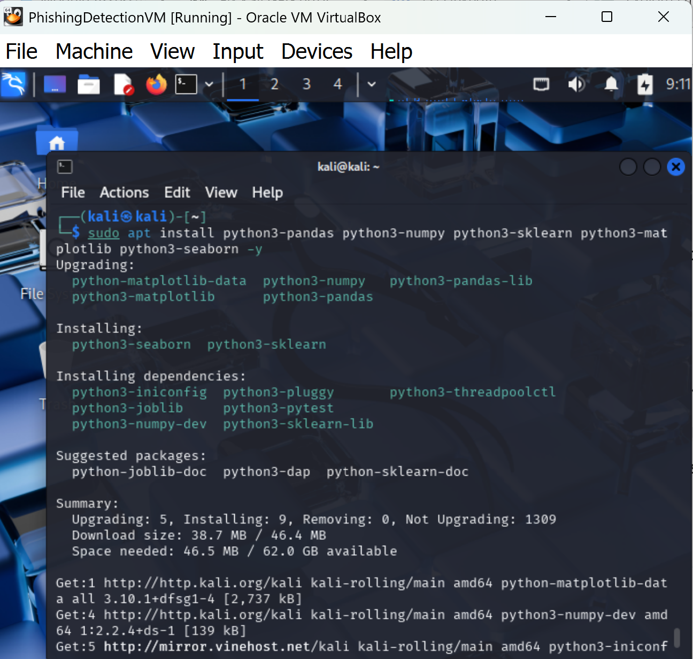
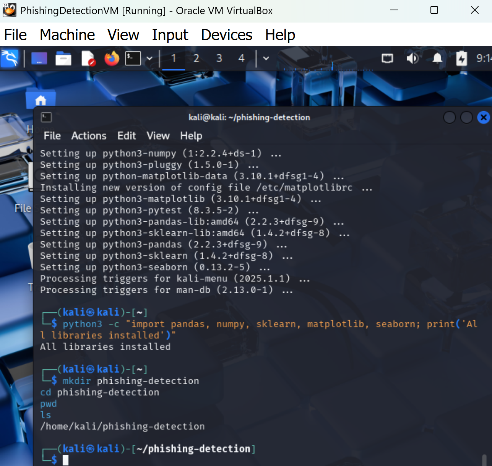
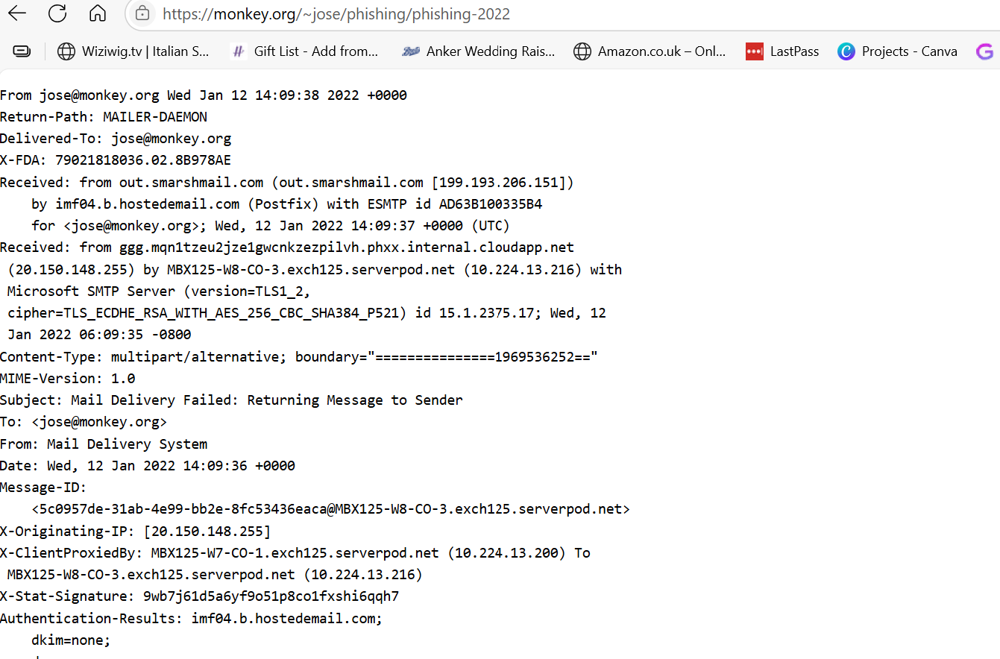
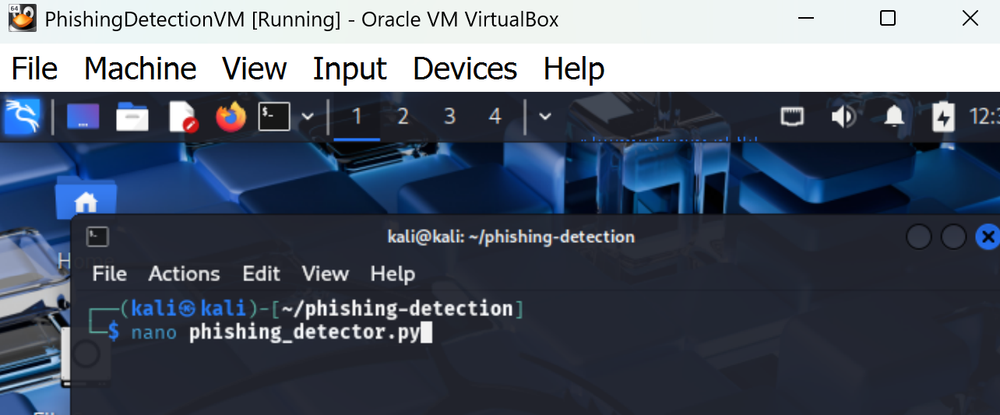
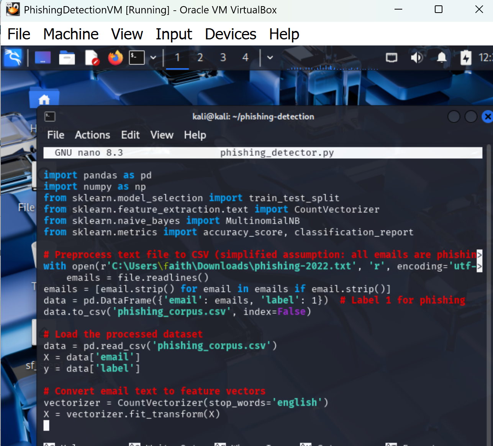
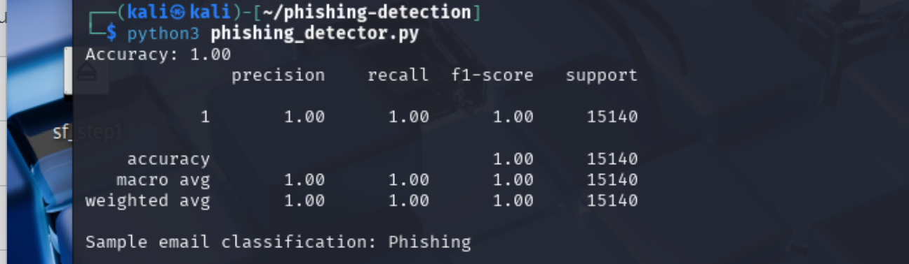

# phishing-detection
AI-Powered Phishing Detection Script

Overview

This project develops a machine learning-based phishing detection system using Python and a Naive Bayes classifier to identify phishing emails. Built in a Kali Linux VM, it integrates my cybersecurity skills (vulnerability assessment, penetration testing, incident response, threat detection) and AI knowledge from the IBM Explore Emerging Tech program. This repository mirrors the professional structure of my DMZ network security project.

Step 1: Development Environment Setup

Environment: Kali Linux VM (VirtualBox, version 2025.2).

Tools Installed:

Python 3, pip, Git (sudo apt install python3 python3-pip git -y).
Libraries: pandas, numpy, scikit-learn, matplotlib, seaborn

(sudo apt install python3-pandas python3-numpy python3-sklearn python3-matplotlib python3-seaborn -y).

Project Directory: /home/kali/phishing-detection with Git initialized.

Screenshots:

Package Update: ()

Tool Verification: ()

Library Installation: ()

Project Directory: ()

Library Verification Setup: ()

Step 2: Obtain a Dataset

Dataset: Enron Phishing Dataset downloaded from [https://labs-repos.iit.demokritos.gr/balab/mails.php](https://labs-repos.iit.demokritos.gr/balab/mails.php) on July 30, 2025.
Details: Contains phishing and legitimate emails for training the Naive Bayes model.

Screenshots:

Dataset-download : ()

Step 3: Write the Script

Script: phishing_detector.py implements a Naive Bayes classifier with an embedded README comment block, processing 'phishing-2022.txt'.
Features: Text preprocessing, model training, prediction, and email classification function.

Screenshots:

Script command: ()

script writing: ()

Step 4: Run/Test Script

Test Results: Achieved accuracy of 1.00 on 15,140 samples on July 30, 2025, with 'utf-8-sig' encoding. Sample email "Click here to claim your prize!" classified as Phishing. Note: 100% accuracy suggests all data is labeled as phishing; consider adding legitimate emails for balanced testing.

Screenshots:

Script Test: ()

Author
Faith Dennis OsseAspiring cybersecurity professional with expertise in networking, cryptography, and vulnerability analysis. Connect on LinkedIn.
