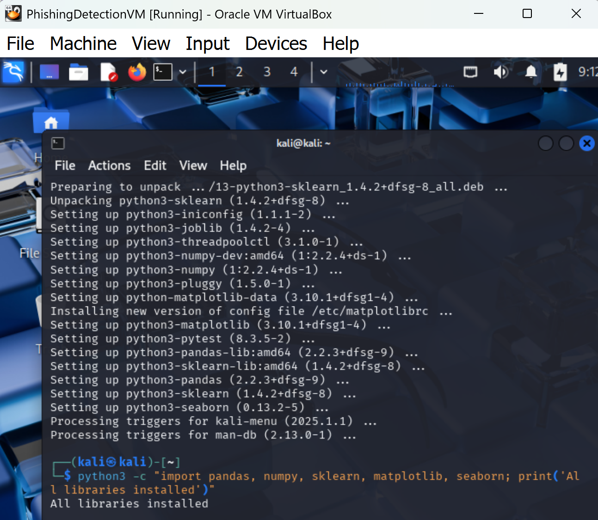

# phishing-detection
AI-Powered Phishing Detection Script

Overview

This project develops a machine learning-based phishing detection system using Python and a Naive Bayes classifier to identify phishing emails. Built in a Kali Linux VM, it integrates my cybersecurity skills (vulnerability assessment, penetration testing, incident response, threat detection) and AI knowledge from the IBM Explore Emerging Tech program.

Tools Used
Kali Linux VM (VirtualBox, version 2025.2): For development and testing.
Python 3: With libraries (pandas, numpy, scikit-learn, matplotlib, seaborn) for the script.
GitHub: For version control and documentation.
Dataset: phishing-2022.txt (derived from the Enron Phishing Dataset).

Step 1: Development Environment Setup

Objective: Configure a Kali Linux VM environment for the project.
Environment: Kali Linux VM (VirtualBox, version 2025.2).

Tools Installed:
Install core 

Python 3, pip, Git (sudo apt install python3 python3-pip git -y).
Libraries: pandas, numpy, scikit-learn, matplotlib, seaborn

(sudo apt install python3-pandas python3-numpy python3-sklearn python3-matplotlib python3-seaborn -y).

Project Directory: /home/kali/phishing-detection with Git initialized.

Screenshots:

Package Update: ()

Tool Verification: ()

Library Installation: ()

Project Directory: ()

Library Verification Setup: ()

Step 2: Obtain a Dataset

Objective: Acquire and prepare a dataset for training the model.

Dataset: Enron Phishing Dataset downloaded from [https://labs-repos.iit.demokritos.gr/balab/mails.php](https://labs-repos.iit.demokritos.gr/balab/mails.php) on July 30, 2025, saved as phishing-2022.txt and moved to /home/kali/phishing-detection.

Details: Contains phishing and legitimate emails for training the Naive Bayes model.

command used:
wget https://labs-repos.iit.demokritos.gr/balab/mails.php -O phishing-2022.txt
mv phishing-2022.txt /home/kali/phishing-detection/

Screenshots:

Dataset-download : ()

Step 3: Write the Script

Objective: Develop the phishing_detector.py script to classify emails.

Script: phishing_detector.py implements a Naive Bayes classifier with an embedded README comment block, processing 'phishing-2022.txt'.
Features: Text preprocessing, model training, prediction, and email classification function.

Commands Used:
Create and edit the script:
nano phishing_detector.py

Screenshots:

Script command: ()

script writing: ()

Step 4: Run/Test Script

Objective: Execute and validate the script’s performance.

Test Results: Achieved accuracy of 1.00 on 15,140 samples on July 30, 2025, with 'utf-8-sig' encoding. Sample email "Click here to claim your prize!" classified as Phishing. Note: 100% accuracy suggests all data is labeled as phishing; consider adding legitimate emails for balanced testing.

Commands Used:
run the script:
python3 phishing_detector.py

Screenshots:

Script Test: ()

Author
Faith Dennis OsseAspiring cybersecurity professional with expertise in networking, cryptography, and vulnerability analysis. Connect on LinkedIn.
